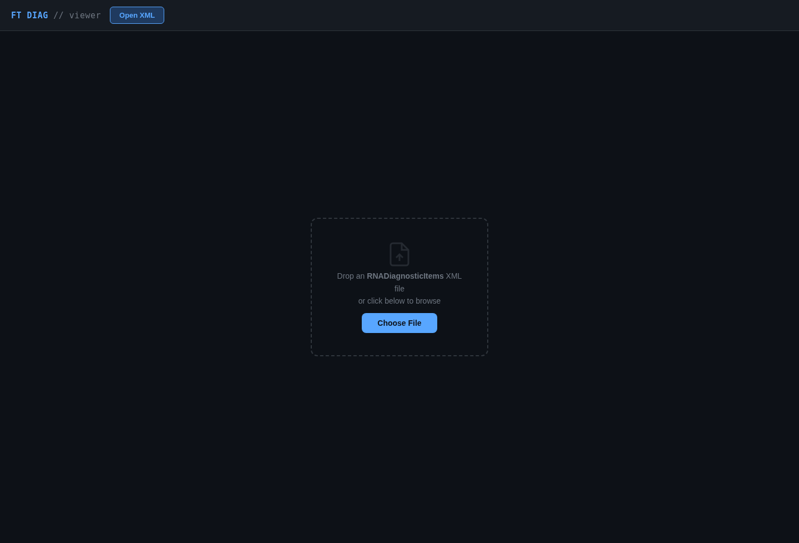
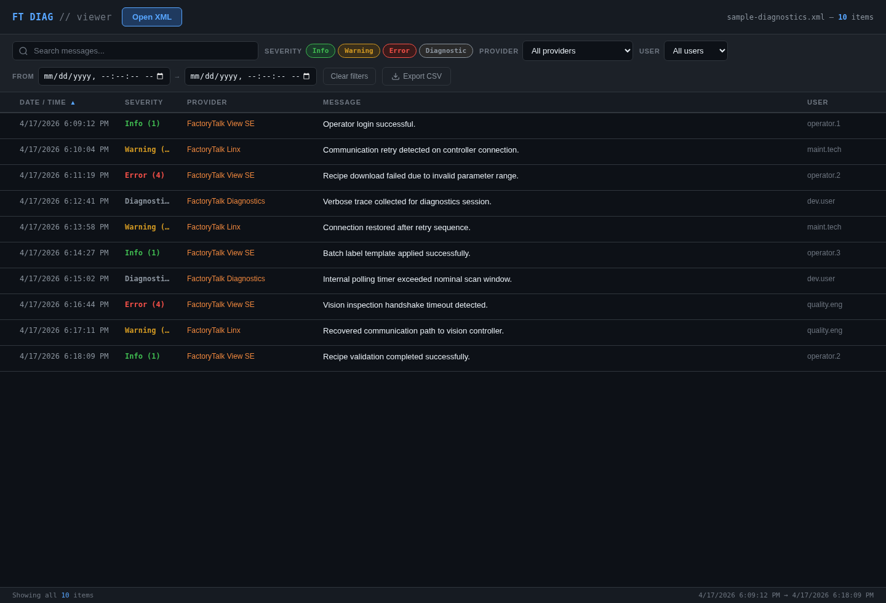
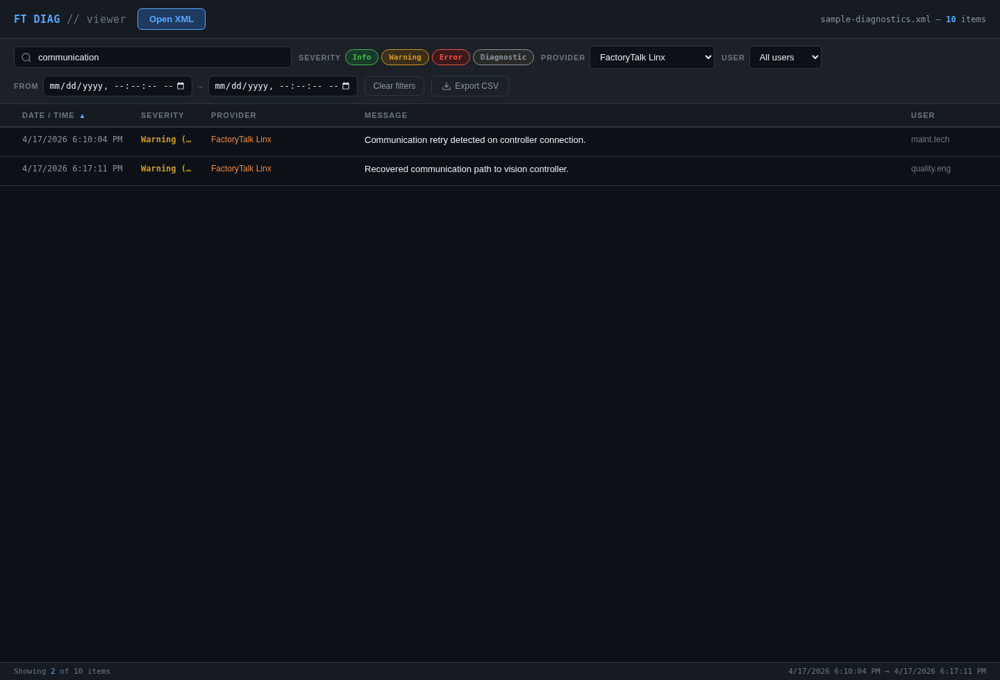
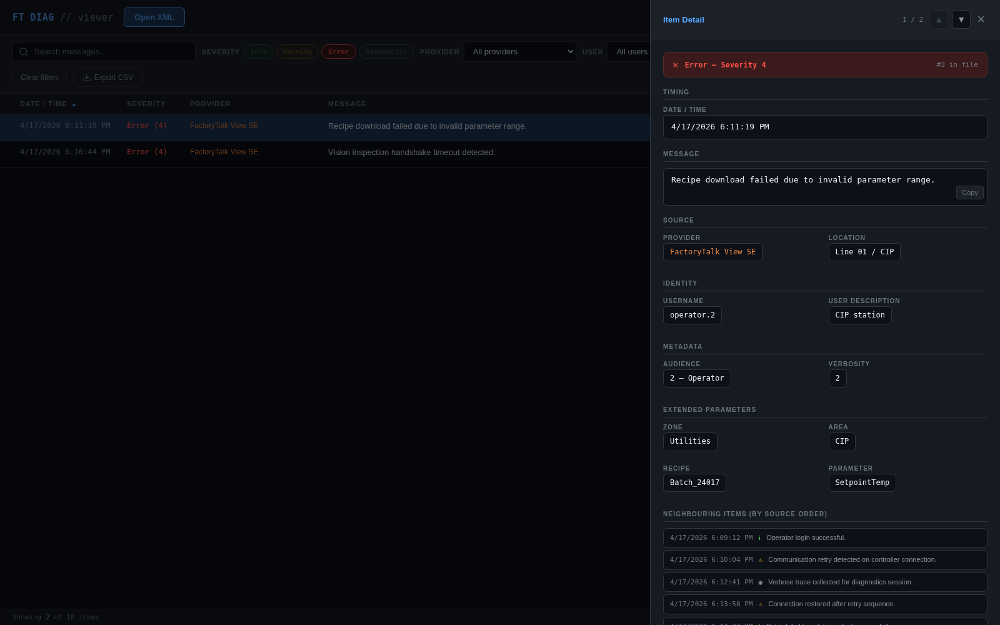

# FT Diagnostics Viewer

A lightweight, client-side viewer for **FactoryTalk / RNADiagnosticItems XML** log files.

This tool makes it easier to inspect diagnostic entries without digging through raw XML. Open a diagnostic export, filter what matters, sort the results, inspect full item details, and export the filtered set to CSV.

## Highlights

- **Open XML files directly in the browser**
- **Drag-and-drop support** for RNADiagnosticItems exports
- **Fast filtering** by message text, severity, provider, user, and date range
- **Sortable table** for date/time, severity, provider, message, and user
- **Virtual scrolling** for large datasets
- **Detail side panel** with full metadata, extended parameters, neighbouring items, and raw XML
- **Copy-to-clipboard** actions for messages and XML snippets
- **CSV export** of the currently filtered results
- **No backend required** — everything runs locally in the browser

## Screenshots

### Landing screen


### Loaded diagnostics table


### Filtered results view


### Detail panel


## How it works

1. Open the app in your browser.
2. Click **Open XML** or drag an XML file into the drop zone.
3. Browse the diagnostics table.
4. Use search and filters to narrow the results.
5. Click any row to inspect the full diagnostic item.
6. Export the filtered view to CSV when needed.

## Supported input

The app is designed for XML files containing `RNADiagnosticItems` entries with `Item` nodes and optional `ExtendedParam` children.

Example structure:

```xml
<RNADiagnosticItems>
  <Item
    datetime="4/17/2026 6:09:12 PM"
    location="Line 01 / Filler"
    provider="FactoryTalk View SE"
    audience="2"
    severity="1"
    message="Operator login successful."
    username="operator.1"
    verbosity="1"
    userdescription="Operator workstation">
    <ExtendedParam Name="zone" Value="Packaging" />
    <ExtendedParam Name="area" Value="Filler" />
  </Item>
</RNADiagnosticItems>
```

## Features in more detail

### Filtering

You can filter diagnostics by:

- message text
- severity
- provider
- user
- date/time range

### Detail inspection

The detail drawer shows:

- severity banner
- date/time
- full message text
- provider and location
- username and user description
- audience and verbosity
- extended parameters
- neighbouring items from the source file
- raw XML for the selected item

### Export

The **Export CSV** action writes the **currently filtered results** to a CSV file so the subset you are reviewing can be shared or analyzed elsewhere.

## Running locally

Because the project is a single HTML file, you can run it in one of two simple ways:

### Option 1: open directly

Open the HTML file in your browser.

### Option 2: serve it locally

```bash
python -m http.server 8000
```

Then open the page in your browser.

## Tech stack

- HTML
- CSS
- Vanilla JavaScript
- Browser FileReader API
- DOMParser

## Notes

- The UI is optimized for dark-theme desktop use.
- The app reads files locally in the browser and does not require a server-side upload flow.
- Screenshots in this README use a small demo XML file for documentation purposes.

## Roadmap ideas

- saved filter presets
- regex search option
- column visibility controls
- multi-file comparison
- richer export formats
- summary charts by severity/provider

## License

Add your preferred license here.
